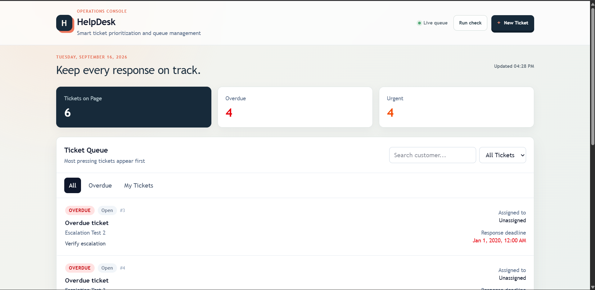

## Conversation 1: Backend Startup Issue

**User request:** Asked what the issue was with the project.

**Finding:** The backend source was structurally valid, but the active Python interpreter was `/home/codespace/.python/current/bin/python`, which did not contain FastAPI or Uvicorn. The project virtual environment at `helpdesk-ticket-system/backend/venv` did contain FastAPI, Uvicorn, and SQLAlchemy.

**Solution:** Run the backend with the project interpreter:

```bash
cd helpdesk-ticket-system/backend
source venv/bin/activate
python -m uvicorn app.main:app --reload --host 0.0.0.0
```

The backend then started successfully and the root endpoint returned HTTP 200.

## Conversation 2: Running The Application

**User request:** Asked to run the project.

**Work completed:**

- Started PostgreSQL with Docker Compose.
- Started the FastAPI backend on port 8000.
- Started the Vite frontend.
- Port 5173 was already occupied, so Vite used port 5174.
- Verified the frontend returned HTTP 200.
- Verified the backend returned `{"message":"Helpdesk Ticket System API is running"}`.

## Conversation 3: Ticket Creation Failure

**User request:** Reported that tickets could not be created.

**Investigation:** The frontend form contained the required fields and the backend schema accepted them. A direct POST request successfully created and persisted a ticket, proving the API and database were working.

The browser was using a forwarded Codespaces frontend URL but the frontend tried to call `localhost:8000` directly. In that situation, the browser's localhost is not the container's localhost, causing `TypeError: Failed to fetch`.

**Solution:**

- Changed the frontend API base URL to same-origin `/api`.
- Added a Vite proxy from `/api` to `http://127.0.0.1:8000`.
- Verified `http://localhost:5173/api/tickets/` returned HTTP 200.
- The frontend build passed.

## Conversation 4: Automatic Escalation Twist

**User request:** Added the requirement that every automated run must escalate tickets that have breached their agreed response time.

**Required rule:**

```text
normal -> high -> urgent
```

A single run can raise a ticket by only one level. Urgent tickets stay urgent.

**Implementation:**

- Created `backend/app/escalation.py`.
- Added `escalate_overdue_tickets()`.
- Selected tickets whose `response_deadline` is earlier than the current time.
- Selected only `normal` and `high` priorities so urgent tickets are excluded.
- Promoted each selected ticket by one level.
- Added a FastAPI background loop that runs at startup and every 60 seconds.
- Added `POST /tickets/escalate-overdue` for manual checks.
- Added `high` to the frontend priority dropdown and styling.

**Verification:** An overdue normal ticket changed to high after the first run and urgent after the second run, proving one-level-per-run behavior.

## Conversation 5: GitHub Publishing

**User request:** Asked to push the project to the repository.

**Work completed:**

- Added the full helpdesk application to Git.
- Added a root `.gitignore` for Python caches, the backend virtual environment, frontend dependencies, and build output.
- Pushed the initial application to `origin/main`.
- Pushed the escalation feature to `origin/main`.
- Confirmed the working tree was clean and synchronized.

## Conversation 6: Documentation

**User request:** Asked for a detailed README and a reasoning document.

**Work completed:**

- Expanded `README.md` with the stack, structure, setup commands, API endpoints, UI, and escalation behavior.
- Created `reasoning.md` explaining what was built, why the technologies were chosen, how the flows work, and what problems were encountered.
- Later shortened `README.md` into a concise quick-start document.
- Rewrote `reasoning.md` into short stages: product definition, core flow, escalation twist, UI work, hard parts, solutions, and final result.

## Conversation 7: UI Enhancement

**User request:** Asked to make the frontend more interactive, colorful, and less plain white.

**Implementation:**

- Added a live queue indicator.
- Added a manual `Run check` button.
- Added a last-updated time.
- Added Escape-key modal closing.
- Added richer hover and disabled states.
- Added responsive layout refinements.
- Added a navy, coral, amber, and green visual direction.
- Added a paper-toned atmospheric background.
- Added animated dashboard entry.
- Added metric card hover movement.
- Added ticket-row hover highlighting.
- Added stronger visual hierarchy around the queue and ticket form.

The frontend production build passed. Lint produced only existing React hook warnings.

## Conversation 8: Screenshots

**User request:** Asked for the UI screenshot to be included in the README.

Automated screenshot capture was attempted with Playwright. Chromium could not initially start because its browser runtime was missing, so Chromium was installed. The container then reported a missing system library, `libatk-1.0.so.0`, and the container user did not have permission to install system packages.

The user later added the screenshot file manually as:

```text
helpdesk-ticket-system/frontend/frontend.png
```

The screenshot was verified and added to the end of `README.md`:

```md
## Screenshot


```

## Conversation 9: Final README And Reasoning Updates

**User request:** Asked for clearer and more concise documentation.

`README.md` was shortened to focus on:

- Stack
- Project structure
- Local setup
- API overview
- Automatic escalation
- Frontend UI
- Validation commands
- Screenshot

`reasoning.md` was shortened into a staged explanation focused on the project journey, hard parts, and solutions.

## Final Technical Summary

The completed application contains:

- React 19 frontend
- Vite development and build tooling
- Tailwind CSS styling
- FastAPI REST API
- Uvicorn ASGI server
- Pydantic request validation
- SQLAlchemy ORM
- PostgreSQL 16 database
- Docker Compose database setup
- Ticket creation and listing
- Customer search
- Overdue and assignee filters
- Pagination
- Queue ordering
- Automatic one-level overdue escalation
- Responsive and interactive dashboard
- Vite API proxy for Codespaces
- README screenshot

## Final Validation

The following checks were completed during development:

- API health endpoint returned HTTP 200.
- Ticket creation returned HTTP 200.
- Tickets persisted in PostgreSQL.
- Overdue normal tickets escalated to high.
- Overdue high tickets escalated to urgent.
- Frontend production build completed successfully.
- Backend compilation completed successfully.
- README screenshot was linked correctly.
- Git working tree was clean after publishing.

## Final GitHub State

All project code and documentation were pushed to the `main` branch of the GitHub repository.

Latest published work includes the interactive UI, concise README, staged reasoning document, and frontend screenshot.
